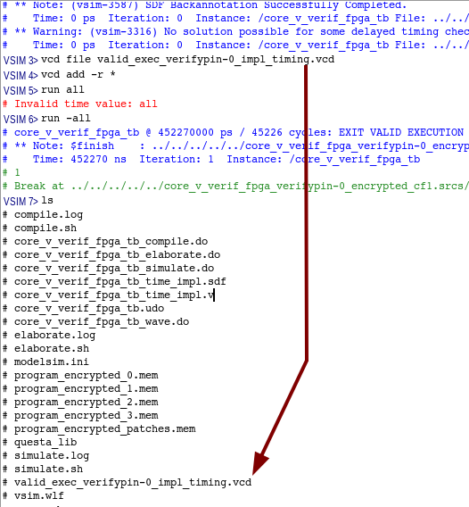

### Prerequisites
#### RISC-V Toolchain
1. Download a RISC-V toolchain. The one used in the paper is available: TODO link with access to the toolchain

2. It is recommended to extract the toolchain in `/opt/corev`. However, if you intend to extract in another location the toolchain, you can create a symbolic link. If you install corev somewhere else, you should edit the `RISCV` variable in `Makefile` or add `RISCV=<path/to/corev>` everytime you execute the `make` command. 
``` bash
ln -s <path/to/corev> /opt/corev
```

#### Verilator: simulator
4. Install Verilator by following the [Git Quick Install](https://veripool.org/guide/latest/install.html#git-quick-install). **Be carefull to select the tag v4.220** by running `git checkout v2.220` before running `autoconf`.

#### GTKwave: wave viewer
4. Verilator simulation can generated waveform (.vcd format). It is recommended to use GTKwave to view waveform.
``` bash
sudo apt install gtkwave
```


The `Makefile` launchs compilation of programs, compilation, elaboration, FPGA synthesis, FPGA implementation of RTL  and simulation.
You can generate `explicit_target_names.mk` by executing `./configure.py`, which contains every valid target name of `Makefile` (usefull to use `<tab>`).
In that case tape `make -f explicit_target_names.mk <tab>`.

### Behavioral simulation only: Verilator
#### Instruction integrity (without Control signal integrity)
1. Simulate execution of `fibonacci`, without encryption and save PC/instr in Fetch at every cycle.
``` bash
make OBJ/PROGRAMS/fibonacci/SIM/LOG/program_save_ref.log
```

2. Simulate execution of `fibonacci`, without encryption, **compare PC/instr in Fetch at every cycle with previously saved reference**, generate reference if not exist.
``` bash
make OBJ/PROGRAMS/fibonacci/SIM/LOG/program_verif.log
```

3. Simulate execution of `fibonacci`, without encryption, **compare PC/instr in Fetch at every cycle with previously saved reference** and generate waveform.
``` bash
make OBJ/PROGRAMS/fibonacci/SIM/VCD/program.vcd
gtkwave OBJ/PROGRAMS/fibonacci/SIM/VCD/program.vcd SRC/CONFIGS/core_v_fpga_signals_debug.gtkw &
```
  
4. Simulate execution of `fibonacci`, **with encryption**, compare PC/instr in Fetch at every cycle with previously saved reference, generate reference if not exist.
``` bash
make OBJ/PROGRAMS/fibonacci/SIM/LOG/program_encrypted_cf1_verif.log
```

4. Simulate execution of `fibonacci`, **with encryption and association of control signals**, compare PC/instr in Fetch at every cycle with previously saved reference, generate reference if not exist.
``` bash
make OBJ/PROGRAMS/fibonacci/SIM/LOG/program_encrypted_cf1_cs1_verif.log
```

5. Execute previous command for all programs with a for loop. You may run `watch -n1 tail -n 40 OBJ/LOG/overview.log` in another terminal to follow campaign execution.
``` bash
for program in SRC/PROGRAMS/* ; do make OBJ/PROGRAMS/$(basename ${program})/SIM/LOG/program_encrypted_verif.log; done
for cf in 1 2 3 6; do for a in SRC/PROGRAMS/* ; do make OBJ/PROGRAMS/$(basename $a)/SIM/LOG/program_encrypted_cf${cf}_verif.log; done; done
for cf in 1 2 3 6; do for cs in 1 2 3 4 5 6 7 8 9; do for a in SRC/PROGRAMS/* ; do make OBJ/PROGRAMS/$(basename $a)/SIM/LOG/program_encrypted_cf${cf}_cs${cs}_verif.log; done; done; done
```
or
``` bash
PROGRAMS_REDUCED=("cubic" "dhrystone" "sglib-combined" "slre" "st" "statemate" "tarfind" "ud" "wikisort")
for program in ${PROGRAMS_REDUCED} ; do make OBJ/PROGRAMS/$(basename ${program})/SIM/LOG/program_encrypted_verif.log; done
```

6. Every time a simulation is performed, a log file is generated :
    - `OBJ/PROGRAMS/<program_name>/SIM/LOG/<program_name>_save_ref.log`
    - `OBJ/PROGRAMS/<program_name>/SIM/LOG/<program_name>_verif.log`
    - `OBJ/PROGRAMS/<program_name>/SIM/LOG/<program_name>_encrypted_verif.log`

7. Explicit target names can be generated.
``` bash
python3 ./configure.py
make -f explicit_target_names.mk <tab>
```

8. Every time a simulation is performed, a line is added in `OBJ/LOG/overview.log`, after step **5**, `overview.log` looks like table in [Results](#results)

#### Instruction and Control signal integrity
1. Get statistics about control signal association, run in the main `core-v-verif-fpga` folder:
``` bash
python3 SRC/SCRIPTS/control_signal_analysis.py
``` 


2. Get statistics on Embench programs and patch
```
python3 SRC/SCRIPTS/control_signal_analysis.py
```

3. Software fix to respect limitation of 12 successors of jalr if on of them is a br/jal
Qrduino and picojpeg do not respect the limitation because of multiple calls to setmask, 
We insert after compilation, assembling but before link, nop at the place a branch/jal destination of the concerned jalr.
qrduino_fix
picojpeg_fix

### FPGA Flow : Vivado/Questa

#### Synthesis, Implementation, Write Bitstream and Simulation


9. Create, synthesis and implement vivado project of core_v_verif_fpga , without encryption, with fibonacci program load in memory.
``` bash
make OBJ/VIVADO_OBJ_DIR/core_v_verif_fpga_fibonacci/
```


9. Launch behavioral simulation with questa of vivado project of core_v_verif_fpga, without encryption, with fibonacci program load in memory.
``` bash
make OBJ/VIVADO_OBJ_DIR/core_v_verif_fpga_fibonacci/.simulate_behav_log.timestamp
```


9. Compilation, elaboration and simulation logs are available in this folder:
``` bash
OBJ/VIVADO_OBJ_DIR/core_v_verif_fpga_fibonacci_encrypted_cf2/core_v_verif_fpga_fibonacci_encrypted_cf1.sim/sim_1/behav/questa/
```


9. Delay of all simulations launched can be measured with:
``` bash
./SRC/SCRIPTS/time_for_sim.sh [Optional <path_to_folders>]
./SRC/SCRIPTS/time_for_sim.sh OBJ/VIVADO_OBJ_DIR/ 
```

9. To save waveforms in any questa folder, type these commands in VSIM terminal.
``` bash
restart
vcd file <vcd_file_name>
vcd add -r *
run all
```
<p align="center">
     
</p>
<p style="text-align: center; font-style: italic;">Example of vcd generation in questa.</p>

9. Launch behavioral, functionnal and timing after synthesis, functionnal and timing after implementation simulations with questa of vivado project of core_v_verif_fpga, without encryption, with fibonacci program load in memory.
``` bash
make OBJ/VIVADO_OBJ_DIR/core_v_verif_fpga_fibonacci/.simulate_log.timestamp
```

9. You can rerun a previous simulation by running. Add option "-c" to run questa in command line.
``` bash
./SRC/SCRIPTS/launch_questa_simulation.sh OBJ/VIVADO_OBJ_DIR/core_v_verif_fpga_fibonacci_encrypted_cf2/core_v_verif_fpga_fibonacci_encrypted_cf1.sim/sim_1/behav/questa/ -c
./SRC/SCRIPTS/launch_questa_simulation.sh OBJ/VIVADO_OBJ_DIR/core_v_verif_fpga_fibonacci_encrypted_cf2/core_v_verif_fpga_fibonacci_encrypted_cf1.sim/sim_1/behav/questa/
./SRC/SCRIPTS/launch_questa_simulation.sh OBJ/VIVADO_OBJ_DIR/core_v_verif_fpga_fibonacci_encrypted_cf2/core_v_verif_fpga_fibonacci_encrypted_cf1.sim/sim_1/impl/timing/questa
```


9. Launch behavioral, functionnal and timing after synthesis, functionnal and timing after implementation simulations with questa of vivado project of core_v_verif_fpga, with encryption (CF=1), with fibonacci program load in memory.
``` bash
make OBJ/VIVADO_OBJ_DIR/core_v_verif_fpga_fibonacci_encrypted_cf1/.simulate_log.timestamp
```

9. Launch behavioral, functionnal and timing after synthesis, functionnal and timing after implementation simulations with questa of vivado project of core_v_verif_fpga, with encryption (CF=6), with fibonacci program load in memory.
``` bash
make OBJ/VIVADO_OBJ_DIR/core_v_verif_fpga_fibonacci_encrypted_cf6/.simulate_log.timestamp
```

9. Find maximal frequency of a design. All checkpoints, reports for specific frequency are saved in `OBJ/VIVADO_OBJ_DIR/<project_name>/<project_name>i.try_freq/try_freq__<YYYY-MM-DD>__<hh-mm-ss>`. The procedure `proc TryFreq {fmin fmax step nb_hw_perm}` is in `./SRC/SCRIPTS/try_frequencies_2clks.tcl`. 
``` bash
vivado -mode tcl
open_project <path_to_xpr>
source ./SRC/SCRIPTS/try_frequencies_2clks.tcl
TryFreq 10 60 1 1
```
For each tested frequency, bitstream, checkpoint and reports are generated in : 
``` bash
try_freq__<YYYY-MM-DD>__<hh-mm-ss>
└─ freq_<Fcore>_<Fascon>
    ├── <project_name>_freq_<Fcore>_<Fascon>.bit
    ├── <project_name>_freq_<Fcore>_<Fascon>_checkpoint.dcp
    ├── <project_name>_freq_<Fcore>_<Fascon>_design-analysis.rpt
    ├── <project_name>_freq_<Fcore>_<Fascon>_report_utilization_hierarchical.rpt
    ├── <project_name>_freq_<Fcore>_<Fascon>_report_utilization.rpt
    └── <project_name>_freq_<Fcore>_<Fascon>_timing.rpt
```


10. Display graph

#### Bitstream download

9. To collect every bitstream file, (from `core-v-verif-fpga` folder):
``` bash
cd core-v-verif-fpga
mkdir -p OBJ/VIVADO_OBJ_DIR/BIT
foreach b in $(find . -name "core_v_verif_fpga_top.bit" | sort); do echo "Copy $b" && cp $b OBJ/VIVADO_OBJ_DIR/BIT/$(echo $b | sed 's!.*core_v_verif_fpga_\(.*\)/core_v_verif_fpga_.*\.runs.*!core_v_verif_fpga_\1.bit!g'); done

```

10. To load bitstreams into FPGA: (depending on the board/FPGA used adapt tcl scripts)
``` bash
vivado -mode tcl
set argv "OBJ/VIVADO_OBJ_DIR/BIT/core_v_verif_fpga_verifypin-0_encrypted_cf1.bit"
source SRC/SCRIPTS/program_bitstream.tcl 
set argv "OBJ/VIVADO_OBJ_DIR/BIT/core_v_verif_fpga_verifypin-0_encrypted_cf6.bit"
source SRC/SCRIPTS/only_program_bitstream.tcl 
```

10. On FPGA, led should be like described in [leds](leds)


# Reproduce paper results

## Percentage of never-sequential instructions (jal/jalr)
```
python3 program_analysis.py
Program: lines |      br      |      jal     |     jalr
[...]
AVERAGE:  4297 |   380(0.088) |   144(0.034) |   490(0.114)
```
There are 0.148 (0.034+0.114), i.e., 14.8% of jal/jalr in Embench programs compiled with -Os


## Folder organization

The `core-v-verif-fpga` is organized as follow:

```
core-v-verif-fpga
|-- configure.py                -- script to generate explicit_target_names.mk (explicit copy of all Makefile targets)
|-- explicit_target_names.mk
|-- Makefile
|-- OBJ                         -- contains every object generated (remove by make clean)
|-- README.md
|-- SRC
|   |-- BENCH                   -- test-bench in .cpp (for verilator) and .sv (for questa/modelsim)
|   |-- CONFIGS                 -- default signals for simulator waveforms
|   |-- PROGRAMS                -- program source of .c programs mainly taken from Embench
|   |-- PROGRAM_TOOLS           -- BSP (Board Support Package) source
|   |-- RTL                     -- RTL (Register Transfer Level) description of cv32e40p (git clone), top, memories, ascon decryption
|   |-- SCRIPTS                 -- .py scripts to encrypt instructions and generate patches, .tcl scripts to create, simulate, search freq max of FPGA vivado projects
|   |-- XDC                     -- constraints for FPGA design
```

```
core-v-verif-fpga
|-- SRC
|-- OBJ
    |-- LOG
    |   |-- overview.log
    |-- PROGRAMS
    |   |-- crc32
    |   |-- cubic
    |   |-- dhrystone
    |   |-- edn
    |   |-- fibonacci
    |   |--  ...
    |   |-- wikisort
    |-- PROGRAM_TOOLS
    |   |-- BSP
    |-- VERILATOR_OBJ_DIR
    |   |-- core_v_verif_fpga
    |   |-- core_v_verif_fpga_encrypted_cf1
    |   |-- core_v_verif_fpga_encrypted_cf2
    |   |-- core_v_verif_fpga_encrypted_cf3
    |   |-- core_v_verif_fpga_encrypted_cf6
    |   |-- core_v_verif_fpga_encrypted_vcd_cf1
    |-- VIVADO_OBJ_DIR
        |-- BIT
        |-- core_v_verif_fpga_fibonacci_encrypted_cf1
        |-- core_v_verif_fpga_fibonacci_encrypted_cf1
```

## Core_v_verif_fpga design

### Compession extension
The compression instructions are not supported. The file `cv32e40p_compressed_decoder.sv` was edited to remove decoding of compress instructions.
A compress instruction is consider illegal. You should define C_EXTENSION if you intent to execute compress instructions.
### ASCON decryption

#### Control signals
- todo:explanation

### I/O
#### Leds
On FPGA, the leds are equal to:
- led_o[7] **Y13** = reset enable
- led_o[6] **W15** = exit valid

If the encrypted design is used:
- led_o[5] **W16** = illegal instruction detected in decode
- led_o[0:3] **U16/T16/T15/T14** = instr_addr_s[15:12] ^ instr_addr_s[11:8] ^ instr_addr_s[7:4] ^ {instr_addr_s[3:2], 2'b00};

Every program end by executing a *jump to itself* instruction (last instruction of `<_exit>`) encoded by *0000006f*. The last instr_addr_s is at PC+8 of the *jump to itself* instruction.


#### Example of successfull program encryption execution: Wikisort
<p align="center">
     
</p>
<p style="text-align: center; font-style: italic;">Execution of wikisort reset enable.</p>


<p align="center">
    
</p>
<p style="text-align: center; font-style: italic;">Execution of wikisort reset disable.</p>

As the *jump to itself* instruction is at address 0x1ef0, led[3:0] = 1 ^ e ^ f ^ 8 = 0x8 = 0b1000.

#### Example of unsuccessfull program encryption execution: Qrduino

The qrduino program contains JALR which has more than 11 successors, some of these successors are JAL or BRANCH. Thus, redirection has to be set-up, however the solution is not compatible with redirection with more than 11 successors.
<p align="center">
    
</p>
<p style="text-align: center; font-style: italic;">Execution of qrduino reset enable.</p>

<p align="center">
    
</p>
<p style="text-align: center; font-style: italic;">Execution of qrduino reset disable.</p>

Led[5] indicates that an invalid instruction was in the decode. As the `instr_addrs_s` always fluctuates the led[3:0] are high.

## Annexe
### Results

|   PROGRAM_NAME   | ENCRYPT |   MODE   |    TEST   | REASON END. |  SIM_TIME  | FIRST ERR. |       TIMESTAMP
|:----------------:|:-------:|:--------:|:---------:|:-----------:|:----------:|:----------:|:----------------------:|
|       crc32      |         |SAVE/TRACE|           |  VALID EXEC |    1149080 |            | Tue Mar 26 16:41:13 2024
|       crc32      |         | SAVE_REF |           |  VALID EXEC |    1149080 |            | Tue Mar 26 16:41:29 2024
|       crc32      | ENCRYPT |   VERIF  |  SUCCESS  |  VALID EXEC |    1149080 |            | Tue Mar 26 16:41:32 2024
|       cubic      |         |SAVE/TRACE|           |  VALID EXEC |    1380282 |            | Tue Mar 26 16:41:34 2024
|       cubic      |         | SAVE_REF |           |  VALID EXEC |    1380282 |            | Tue Mar 26 16:41:55 2024
|       cubic      | ENCRYPT |   VERIF  |  SUCCESS  |  VALID EXEC |    1380282 |            | Tue Mar 26 16:41:58 2024
|     dhrystone    |         |SAVE/TRACE|           |  VALID EXEC |     611550 |            | Tue Mar 26 16:41:59 2024
|     dhrystone    |         | SAVE_REF |           |  VALID EXEC |     611550 |            | Tue Mar 26 16:42:08 2024
|     dhrystone    | ENCRYPT |   VERIF  |  SUCCESS  |  VALID EXEC |     611550 |            | Tue Mar 26 16:42:09 2024
|        edn       |         |SAVE/TRACE|           |  VALID EXEC |     642402 |            | Tue Mar 26 16:42:10 2024
|        edn       |         | SAVE_REF |           |  VALID EXEC |     642402 |            | Tue Mar 26 16:42:19 2024
|        edn       | ENCRYPT |   VERIF  |  SUCCESS  |  VALID EXEC |     642402 |            | Tue Mar 26 16:42:21 2024
|     fibonacci    |         |SAVE/TRACE|           |  VALID EXEC |     187694 |            | Tue Mar 26 16:42:21 2024
|     fibonacci    |         | SAVE_REF |           |  VALID EXEC |     187694 |            | Tue Mar 26 16:42:25 2024
|     fibonacci    | ENCRYPT |   VERIF  |  SUCCESS  |  VALID EXEC |     187694 |            | Tue Mar 26 16:42:25 2024
|     huffbench    |         |SAVE/TRACE|           |  VALID EXEC |     904196 |            | Tue Mar 26 16:42:26 2024
|     huffbench    |         | SAVE_REF |           |  VALID EXEC |     904196 |            | Tue Mar 26 16:42:39 2024
|     huffbench    | ENCRYPT |   VERIF  |  SUCCESS  |  VALID EXEC |     904196 |            | Tue Mar 26 16:42:41 2024
|    matmult-int   |         |SAVE/TRACE|           |  VALID EXEC |     839262 |            | Tue Mar 26 16:42:42 2024
|    matmult-int   |         | SAVE_REF |           |  VALID EXEC |     839262 |            | Tue Mar 26 16:42:54 2024
|    matmult-int   | ENCRYPT |   VERIF  |  SUCCESS  |  VALID EXEC |     839262 |            | Tue Mar 26 16:42:56 2024
|      md5sum      |         |SAVE/TRACE|           |  VALID EXEC |     681136 |            | Tue Mar 26 16:42:57 2024
|      md5sum      |         | SAVE_REF |           |  VALID EXEC |     681136 |            | Tue Mar 26 16:43:06 2024
|      md5sum      | ENCRYPT |   VERIF  |  SUCCESS  |  VALID EXEC |     681136 |            | Tue Mar 26 16:43:08 2024
|      minver      |         |SAVE/TRACE|           |  VALID EXEC |     785076 |            | Tue Mar 26 16:43:09 2024
|      minver      |         | SAVE_REF |           |  VALID EXEC |     785076 |            | Tue Mar 26 16:43:21 2024
|      minver      | ENCRYPT |   VERIF  |  SUCCESS  |  VALID EXEC |     785076 |            | Tue Mar 26 16:43:23 2024
|      mont64      |         |SAVE/TRACE|           |  VALID EXEC |     515094 |            | Tue Mar 26 16:43:24 2024
|      mont64      |         | SAVE_REF |           |  VALID EXEC |     515094 |            | Tue Mar 26 16:43:31 2024
|      mont64      | ENCRYPT |   VERIF  |  SUCCESS  |  VALID EXEC |     515094 |            | Tue Mar 26 16:43:33 2024
|       nbody      |         |SAVE/TRACE|           |  VALID EXEC |    4387282 |            | Tue Mar 26 16:43:38 2024
|       nbody      |         | SAVE_REF |           |  VALID EXEC |    4387282 |            | Tue Mar 26 16:44:35 2024
|       nbody      | ENCRYPT |   VERIF  |  SUCCESS  |  VALID EXEC |    4387282 |            | Tue Mar 26 16:44:46 2024
|    nettle-aes    |         |SAVE/TRACE|           |  VALID EXEC |     540220 |            | Tue Mar 26 16:44:47 2024
|    nettle-aes    |         | SAVE_REF |           |  VALID EXEC |     540220 |            | Tue Mar 26 16:44:54 2024
|    nettle-aes    | ENCRYPT |   VERIF  |  SUCCESS  |  VALID EXEC |     540220 |            | Tue Mar 26 16:44:55 2024
|   nettle-sha256  |         |SAVE/TRACE|           |  VALID EXEC |     277932 |            | Tue Mar 26 16:44:56 2024
|   nettle-sha256  |         | SAVE_REF |           |  VALID EXEC |     277932 |            | Tue Mar 26 16:45:01 2024
|   nettle-sha256  | ENCRYPT |   VERIF  |  SUCCESS  |  VALID EXEC |     277932 |            | Tue Mar 26 16:45:01 2024
|     nsichneu     |         |SAVE/TRACE|           |  VALID EXEC |     306970 |            | Tue Mar 26 16:45:03 2024
|     nsichneu     |         | SAVE_REF |           |  VALID EXEC |     306970 |            | Tue Mar 26 16:45:08 2024
|     nsichneu     | ENCRYPT |   VERIF  |  SUCCESS  |  VALID EXEC |     306970 |            | Tue Mar 26 16:45:08 2024
|     picojpeg     |         |SAVE/TRACE|           |  VALID EXEC |    1927668 |            | Tue Mar 26 16:45:11 2024
|     picojpeg     |         | SAVE_REF |           |  VALID EXEC |    1927668 |            | Tue Mar 26 16:45:37 2024
|     picojpeg     | ENCRYPT |   VERIF  |  FAILURE  |  REF ERROR  |      75190 |      75169 | Tue Mar 26 16:45:38 2024
|    primecount    |         |SAVE/TRACE|           |  VALID EXEC |     896720 |            | Tue Mar 26 16:45:39 2024
|    primecount    |         | SAVE_REF |           |  VALID EXEC |     896720 |            | Tue Mar 26 16:45:51 2024
|    primecount    | ENCRYPT |   VERIF  |  SUCCESS  |  VALID EXEC |     896720 |            | Tue Mar 26 16:45:54 2024
|      qrduino     |         |SAVE/TRACE|           |  VALID EXEC |    1672566 |            | Tue Mar 26 16:45:56 2024
|      qrduino     |         | SAVE_REF |           |  VALID EXEC |    1672566 |            | Tue Mar 26 16:46:19 2024
|      qrduino     | ENCRYPT |   VERIF  |  FAILURE  |  REF ERROR  |     109746 |     109725 | Tue Mar 26 16:46:20 2024
|  sglib-combined  |         |SAVE/TRACE|           |  VALID EXEC |     688540 |            | Tue Mar 26 16:46:21 2024
|  sglib-combined  |         | SAVE_REF |           |  VALID EXEC |     688540 |            | Tue Mar 26 16:46:31 2024
|  sglib-combined  | ENCRYPT |   VERIF  |  SUCCESS  |  VALID EXEC |     688540 |            | Tue Mar 26 16:46:33 2024
|       slre       |         |SAVE/TRACE|           |  VALID EXEC |     306600 |            | Tue Mar 26 16:46:34 2024
|       slre       |         | SAVE_REF |           |  VALID EXEC |     306600 |            | Tue Mar 26 16:46:39 2024
|       slre       | ENCRYPT |   VERIF  |  SUCCESS  |  VALID EXEC |     306600 |            | Tue Mar 26 16:46:39 2024
|        st        |         |SAVE/TRACE|           |  VALID EXEC |    1126622 |            | Tue Mar 26 16:46:41 2024
|        st        |         | SAVE_REF |           |  VALID EXEC |    1126622 |            | Tue Mar 26 16:46:57 2024
|        st        | ENCRYPT |   VERIF  |  SUCCESS  |  VALID EXEC |    1126622 |            | Tue Mar 26 16:46:59 2024
|     statemate    |         |SAVE/TRACE|           |  VALID EXEC |     240826 |            | Tue Mar 26 16:47:00 2024
|     statemate    |         | SAVE_REF |           |  VALID EXEC |     240826 |            | Tue Mar 26 16:47:04 2024
|     statemate    | ENCRYPT |   VERIF  |  SUCCESS  |  VALID EXEC |     240826 |            | Tue Mar 26 16:47:04 2024
|      tarfind     |         |SAVE/TRACE|           |  VALID EXEC |     717312 |            | Tue Mar 26 16:47:06 2024
|      tarfind     |         | SAVE_REF |           |  VALID EXEC |     717312 |            | Tue Mar 26 16:47:18 2024
|      tarfind     | ENCRYPT |   VERIF  |  SUCCESS  |  VALID EXEC |     717312 |            | Tue Mar 26 16:47:20 2024
|        ud        |         |SAVE/TRACE|           |  VALID EXEC |     588562 |            | Tue Mar 26 16:47:21 2024
|        ud        |         | SAVE_REF |           |  VALID EXEC |     588562 |            | Tue Mar 26 16:47:30 2024
|        ud        | ENCRYPT |   VERIF  |  SUCCESS  |  VALID EXEC |     588562 |            | Tue Mar 26 16:47:32 2024
|    verifypin_0   |         |SAVE/TRACE|           |  VALID EXEC |      18938 |            | Tue Mar 26 16:47:32 2024
|    verifypin_0   |         | SAVE_REF |           |  VALID EXEC |      18938 |            | Tue Mar 26 16:47:34 2024
|    verifypin_0   | ENCRYPT |   VERIF  |  SUCCESS  |  VALID EXEC |      18938 |            | Tue Mar 26 16:47:34 2024
|     wikisort     |         |SAVE/TRACE|           |  VALID EXEC |    3579694 |            | Tue Mar 26 16:47:38 2024
|     wikisort     |         | SAVE_REF |           |  VALID EXEC |    3579694 |            | Tue Mar 26 16:48:27 2024
|     wikisort     | ENCRYPT |   VERIF  |  SUCCESS  |  VALID EXEC |    3579694 |            | Tue Mar 26 16:48:35 2024


|   PROGRAM_NAME   | ENCRYPT |C_F|   MODE   |    TEST   | REASON END. |  SIM_TIME  | FIRST ERR. |       TIMESTAMP         
|:----------------:|:-------:|:-:|:--------:|:---------:|:-----------:|:----------:|:----------:|:----------------------:|
|       crc32      |         |   |SAVE/TRACE|           |  VALID EXEC |    1149080 |            | Thu Mar 28 09:41:03 2024
|       crc32      | ENCRYPT | 1 |   VERIF  |  SUCCESS  |  VALID EXEC |    1149080 |            | Thu Mar 28 09:44:59 2024
|       cubic      |         |   |SAVE/TRACE|           |  VALID EXEC |    1380282 |            | Thu Mar 28 09:45:02 2024
|       cubic      | ENCRYPT | 1 |   VERIF  |  SUCCESS  |  VALID EXEC |    1380282 |            | Thu Mar 28 09:45:25 2024
|     dhrystone    |         |   |SAVE/TRACE|           |  VALID EXEC |     611550 |            | Thu Mar 28 09:45:26 2024
|     dhrystone    | ENCRYPT | 1 |   VERIF  |  SUCCESS  |  VALID EXEC |     611550 |            | Thu Mar 28 09:45:36 2024
|        edn       |         |   |SAVE/TRACE|           |  VALID EXEC |     642402 |            | Thu Mar 28 09:45:37 2024
|        edn       | ENCRYPT | 1 |   VERIF  |  SUCCESS  |  VALID EXEC |     642402 |            | Thu Mar 28 09:45:47 2024
|     fibonacci    | ENCRYPT | 1 |   VERIF  |  SUCCESS  |  VALID EXEC |     187694 |            | Thu Mar 28 09:45:48 2024
|     huffbench    |         |   |SAVE/TRACE|           |  VALID EXEC |     904196 |            | Thu Mar 28 09:45:49 2024
|     huffbench    | ENCRYPT | 1 |   VERIF  |  SUCCESS  |  VALID EXEC |     904196 |            | Thu Mar 28 09:46:03 2024
|    matmult-int   |         |   |SAVE/TRACE|           |  VALID EXEC |     839262 |            | Thu Mar 28 09:46:04 2024
|    matmult-int   | ENCRYPT | 1 |   VERIF  |  SUCCESS  |  VALID EXEC |     839262 |            | Thu Mar 28 09:46:17 2024
|      md5sum      |         |   |SAVE/TRACE|           |  VALID EXEC |     681136 |            | Thu Mar 28 09:46:19 2024
|      md5sum      | ENCRYPT | 1 |   VERIF  |  SUCCESS  |  VALID EXEC |     681136 |            | Thu Mar 28 09:46:29 2024
|      minver      |         |   |SAVE/TRACE|           |  VALID EXEC |     785076 |            | Thu Mar 28 09:46:31 2024
|      minver      | ENCRYPT | 1 |   VERIF  |  SUCCESS  |  VALID EXEC |     785076 |            | Thu Mar 28 09:46:43 2024
|      mont64      |         |   |SAVE/TRACE|           |  VALID EXEC |     515094 |            | Thu Mar 28 09:46:44 2024
|      mont64      | ENCRYPT | 1 |   VERIF  |  SUCCESS  |  VALID EXEC |     515094 |            | Thu Mar 28 09:46:52 2024
|       nbody      |         |   |SAVE/TRACE|           |  VALID EXEC |    4387282 |            | Thu Mar 28 09:46:57 2024
|       nbody      | ENCRYPT | 1 |   VERIF  |  SUCCESS  |  VALID EXEC |    4387282 |            | Thu Mar 28 09:48:02 2024
|    nettle-aes    |         |   |SAVE/TRACE|           |  VALID EXEC |     540220 |            | Thu Mar 28 09:48:03 2024
|    nettle-aes    | ENCRYPT | 1 |   VERIF  |  SUCCESS  |  VALID EXEC |     540220 |            | Thu Mar 28 09:48:11 2024
|   nettle-sha256  |         |   |SAVE/TRACE|           |  VALID EXEC |     277932 |            | Thu Mar 28 09:48:12 2024
|   nettle-sha256  | ENCRYPT | 1 |   VERIF  |  SUCCESS  |  VALID EXEC |     277932 |            | Thu Mar 28 09:48:17 2024
|     nsichneu     |         |   |SAVE/TRACE|           |  VALID EXEC |     306970 |            | Thu Mar 28 09:48:18 2024
|     nsichneu     | ENCRYPT | 1 |   VERIF  |  SUCCESS  |  VALID EXEC |     306970 |            | Thu Mar 28 09:48:24 2024
|     picojpeg     |         |   |SAVE/TRACE|           |  VALID EXEC |    1927668 |            | Thu Mar 28 09:48:27 2024
|     picojpeg     | ENCRYPT | 1 |   VERIF  |  FAILURE  |  REF ERROR  |      75190 |      75169 | Thu Mar 28 09:48:53 2024
|    primecount    |         |   |SAVE/TRACE|           |  VALID EXEC |     896720 |            | Thu Mar 28 09:48:54 2024
|    primecount    | ENCRYPT | 1 |   VERIF  |  SUCCESS  |  VALID EXEC |     896720 |            | Thu Mar 28 09:49:08 2024
|      qrduino     |         |   |SAVE/TRACE|           |  VALID EXEC |    1672566 |            | Thu Mar 28 09:49:10 2024
|      qrduino     | ENCRYPT | 1 |   VERIF  |  FAILURE  |  REF ERROR  |     109746 |     109725 | Thu Mar 28 09:49:32 2024
|  sglib-combined  |         |   |SAVE/TRACE|           |  VALID EXEC |     688540 |            | Thu Mar 28 09:49:34 2024
|  sglib-combined  | ENCRYPT | 1 |   VERIF  |  SUCCESS  |  VALID EXEC |     688540 |            | Thu Mar 28 09:49:45 2024
|       slre       |         |   |SAVE/TRACE|           |  VALID EXEC |     306600 |            | Thu Mar 28 09:49:46 2024
|       slre       | ENCRYPT | 1 |   VERIF  |  SUCCESS  |  VALID EXEC |     306600 |            | Thu Mar 28 09:49:52 2024
|        st        |         |   |SAVE/TRACE|           |  VALID EXEC |    1126622 |            | Thu Mar 28 09:49:53 2024
|        st        | ENCRYPT | 1 |   VERIF  |  SUCCESS  |  VALID EXEC |    1126622 |            | Thu Mar 28 09:50:11 2024
|     statemate    |         |   |SAVE/TRACE|           |  VALID EXEC |     240826 |            | Thu Mar 28 09:50:12 2024
|     statemate    | ENCRYPT | 1 |   VERIF  |  SUCCESS  |  VALID EXEC |     240826 |            | Thu Mar 28 09:50:16 2024
|      tarfind     |         |   |SAVE/TRACE|           |  VALID EXEC |     717312 |            | Thu Mar 28 09:50:17 2024
|      tarfind     | ENCRYPT | 1 |   VERIF  |  SUCCESS  |  VALID EXEC |     717312 |            | Thu Mar 28 09:50:29 2024
|        ud        |         |   |SAVE/TRACE|           |  VALID EXEC |     588562 |            | Thu Mar 28 09:50:30 2024
|        ud        | ENCRYPT | 1 |   VERIF  |  SUCCESS  |  VALID EXEC |     588562 |            | Thu Mar 28 09:50:39 2024
|    verifypin_0   |         |   |SAVE/TRACE|           |  VALID EXEC |      18938 |            | Thu Mar 28 09:50:40 2024
|    verifypin_0   | ENCRYPT | 1 |   VERIF  |  SUCCESS  |  VALID EXEC |      18938 |            | Thu Mar 28 09:50:41 2024
|     wikisort     |         |   |SAVE/TRACE|           |  VALID EXEC |    3579694 |            | Thu Mar 28 09:50:45 2024
|     wikisort     | ENCRYPT | 1 |   VERIF  |  SUCCESS  |  VALID EXEC |    3579694 |            | Thu Mar 28 09:51:39 2024
|       crc32      | ENCRYPT | 2 |   VERIF  |  SUCCESS  |  VALID EXEC |    2298139 |            | Thu Mar 28 09:51:46 2024
|       cubic      | ENCRYPT | 2 |   VERIF  |  SUCCESS  |  VALID EXEC |    2760543 |            | Thu Mar 28 09:51:49 2024
|     dhrystone    | ENCRYPT | 2 |   VERIF  |  SUCCESS  |  VALID EXEC |    1223079 |            | Thu Mar 28 09:51:50 2024
|        edn       | ENCRYPT | 2 |   VERIF  |  SUCCESS  |  VALID EXEC |    1284783 |            | Thu Mar 28 09:51:52 2024
|     fibonacci    | ENCRYPT | 2 |   VERIF  |  SUCCESS  |  VALID EXEC |     375367 |            | Thu Mar 28 09:51:52 2024
|     huffbench    | ENCRYPT | 2 |   VERIF  |  SUCCESS  |  VALID EXEC |    1808371 |            | Thu Mar 28 09:51:54 2024
|    matmult-int   | ENCRYPT | 2 |   VERIF  |  SUCCESS  |  VALID EXEC |    1678503 |            | Thu Mar 28 09:51:56 2024
|      md5sum      | ENCRYPT | 2 |   VERIF  |  SUCCESS  |  VALID EXEC |    1362251 |            | Thu Mar 28 09:51:57 2024
|      minver      | ENCRYPT | 2 |   VERIF  |  SUCCESS  |  VALID EXEC |    1570131 |            | Thu Mar 28 09:51:59 2024
|      mont64      | ENCRYPT | 2 |   VERIF  |  SUCCESS  |  VALID EXEC |    1030167 |            | Thu Mar 28 09:52:00 2024
|       nbody      | ENCRYPT | 2 |   VERIF  |  SUCCESS  |  VALID EXEC |    8774543 |            | Thu Mar 28 09:52:09 2024
|    nettle-aes    | ENCRYPT | 2 |   VERIF  |  SUCCESS  |  VALID EXEC |    1080419 |            | Thu Mar 28 09:52:11 2024
|   nettle-sha256  | ENCRYPT | 2 |   VERIF  |  SUCCESS  |  VALID EXEC |     555843 |            | Thu Mar 28 09:52:11 2024
|     nsichneu     | ENCRYPT | 2 |   VERIF  |  SUCCESS  |  VALID EXEC |     613919 |            | Thu Mar 28 09:52:12 2024
|     picojpeg     | ENCRYPT | 2 |   VERIF  |  FAILURE  |  REF ERROR  |     150359 |     150338 | Thu Mar 28 09:52:12 2024
|    primecount    | ENCRYPT | 2 |   VERIF  |  SUCCESS  |  VALID EXEC |    1793419 |            | Thu Mar 28 09:52:14 2024
|      qrduino     | ENCRYPT | 2 |   VERIF  |  FAILURE  |  REF ERROR  |     219471 |     219450 | Thu Mar 28 09:52:15 2024
|  sglib-combined  | ENCRYPT | 2 |   VERIF  |  SUCCESS  |  VALID EXEC |    1377059 |            | Thu Mar 28 09:52:16 2024
|       slre       | ENCRYPT | 2 |   VERIF  |  SUCCESS  |  VALID EXEC |     613179 |            | Thu Mar 28 09:52:17 2024
|        st        | ENCRYPT | 2 |   VERIF  |  SUCCESS  |  VALID EXEC |    2253223 |            | Thu Mar 28 09:52:19 2024
|     statemate    | ENCRYPT | 2 |   VERIF  |  SUCCESS  |  VALID EXEC |     481631 |            | Thu Mar 28 09:52:20 2024
|      tarfind     | ENCRYPT | 2 |   VERIF  |  SUCCESS  |  VALID EXEC |    1434603 |            | Thu Mar 28 09:52:21 2024
|        ud        | ENCRYPT | 2 |   VERIF  |  SUCCESS  |  VALID EXEC |    1177103 |            | Thu Mar 28 09:52:23 2024
|    verifypin_0   | ENCRYPT | 2 |   VERIF  |  SUCCESS  |  VALID EXEC |      37855 |            | Thu Mar 28 09:52:23 2024
|     wikisort     | ENCRYPT | 2 |   VERIF  |  SUCCESS  |  VALID EXEC |    7159367 |            | Thu Mar 28 09:52:30 2024
|       crc32      | ENCRYPT | 3 |   VERIF  |  SUCCESS  |  VALID EXEC |    3447198 |            | Thu Mar 28 09:52:33 2024
|       cubic      | ENCRYPT | 3 |   VERIF  |  SUCCESS  |  VALID EXEC |    4140804 |            | Thu Mar 28 09:52:36 2024
|     dhrystone    | ENCRYPT | 3 |   VERIF  |  SUCCESS  |  VALID EXEC |    1834608 |            | Thu Mar 28 09:52:37 2024
|        edn       | ENCRYPT | 3 |   VERIF  |  SUCCESS  |  VALID EXEC |    1927164 |            | Thu Mar 28 09:52:39 2024
|     fibonacci    | ENCRYPT | 3 |   VERIF  |  SUCCESS  |  VALID EXEC |     563040 |            | Thu Mar 28 09:52:39 2024
|     huffbench    | ENCRYPT | 3 |   VERIF  |  SUCCESS  |  VALID EXEC |    2712546 |            | Thu Mar 28 09:52:41 2024
|    matmult-int   | ENCRYPT | 3 |   VERIF  |  SUCCESS  |  VALID EXEC |    2517744 |            | Thu Mar 28 09:52:43 2024
|      md5sum      | ENCRYPT | 3 |   VERIF  |  SUCCESS  |  VALID EXEC |    2043366 |            | Thu Mar 28 09:52:44 2024
|      minver      | ENCRYPT | 3 |   VERIF  |  SUCCESS  |  VALID EXEC |    2355186 |            | Thu Mar 28 09:52:46 2024
|      mont64      | ENCRYPT | 3 |   VERIF  |  SUCCESS  |  VALID EXEC |    1545240 |            | Thu Mar 28 09:52:47 2024
|       nbody      | ENCRYPT | 3 |   VERIF  |  SUCCESS  |  VALID EXEC |   13161804 |            | Thu Mar 28 10:07:11 2024
|    nettle-aes    | ENCRYPT | 3 |   VERIF  |  SUCCESS  |  VALID EXEC |    1620618 |            | Thu Mar 28 09:52:56 2024
|   nettle-sha256  | ENCRYPT | 3 |   VERIF  |  SUCCESS  |  VALID EXEC |     833754 |            | Thu Mar 28 09:52:57 2024
|     nsichneu     | ENCRYPT | 3 |   VERIF  |  SUCCESS  |  VALID EXEC |     920868 |            | Thu Mar 28 09:52:58 2024
|     picojpeg     | ENCRYPT | 3 |   VERIF  |  FAILURE  |  REF ERROR  |     225528 |     225507 | Thu Mar 28 09:52:58 2024
|    primecount    | ENCRYPT | 3 |   VERIF  |  SUCCESS  |  VALID EXEC |    2690118 |            | Thu Mar 28 09:53:00 2024
|      qrduino     | ENCRYPT | 3 |   VERIF  |  FAILURE  |  REF ERROR  |     329196 |     329175 | Thu Mar 28 09:53:00 2024
|  sglib-combined  | ENCRYPT | 3 |   VERIF  |  SUCCESS  |  VALID EXEC |    2065578 |            | Thu Mar 28 09:53:02 2024
|       slre       | ENCRYPT | 3 |   VERIF  |  SUCCESS  |  VALID EXEC |     919758 |            | Thu Mar 28 09:53:03 2024
|        st        | ENCRYPT | 3 |   VERIF  |  SUCCESS  |  VALID EXEC |    3379824 |            | Thu Mar 28 09:53:05 2024
|     statemate    | ENCRYPT | 3 |   VERIF  |  SUCCESS  |  VALID EXEC |     722436 |            | Thu Mar 28 09:53:06 2024
|      tarfind     | ENCRYPT | 3 |   VERIF  |  SUCCESS  |  VALID EXEC |    2151894 |            | Thu Mar 28 09:53:07 2024
|        ud        | ENCRYPT | 3 |   VERIF  |  SUCCESS  |  VALID EXEC |    1765644 |            | Thu Mar 28 09:53:09 2024
|    verifypin_0   | ENCRYPT | 3 |   VERIF  |  SUCCESS  |  VALID EXEC |      56772 |            | Thu Mar 28 09:53:09 2024
|     wikisort     | ENCRYPT | 3 |   VERIF  |  SUCCESS  |  VALID EXEC |   10739040 |            | Thu Mar 28 10:08:03 2024
|       crc32      | ENCRYPT | 6 |   VERIF  |  SUCCESS  |  VALID EXEC |    6894375 |            | Thu Mar 28 09:53:33 2024
|       cubic      | ENCRYPT | 6 |   VERIF  |  SUCCESS  |  VALID EXEC |    8281587 |            | Thu Mar 28 09:53:36 2024
|     dhrystone    | ENCRYPT | 6 |   VERIF  |  SUCCESS  |  VALID EXEC |    3669195 |            | Thu Mar 28 09:53:38 2024
|        edn       | ENCRYPT | 6 |   VERIF  |  SUCCESS  |  VALID EXEC |    3854307 |            | Thu Mar 28 09:53:40 2024
|     fibonacci    | ENCRYPT | 6 |   VERIF  |  SUCCESS  |  VALID EXEC |    1126059 |            | Thu Mar 28 09:53:40 2024
|     huffbench    | ENCRYPT | 6 |   VERIF  |  SUCCESS  |  VALID EXEC |    5425071 |            | Thu Mar 28 09:53:42 2024
|    matmult-int   | ENCRYPT | 6 |   VERIF  |  SUCCESS  |  VALID EXEC |    5035467 |            | Thu Mar 28 09:53:45 2024
|      md5sum      | ENCRYPT | 6 |   VERIF  |  SUCCESS  |  VALID EXEC |    4086711 |            | Thu Mar 28 09:53:46 2024
|      minver      | ENCRYPT | 6 |   VERIF  |  SUCCESS  |  VALID EXEC |    4710351 |            | Thu Mar 28 09:53:49 2024
|      mont64      | ENCRYPT | 6 |   VERIF  |  SUCCESS  |  VALID EXEC |    3090459 |            | Thu Mar 28 09:53:50 2024
|       nbody      | ENCRYPT | 6 |   VERIF  |  SUCCESS  |  VALID EXEC |   26323587 |            | Thu Mar 28 10:07:23 2024
|    nettle-aes    | ENCRYPT | 6 |   VERIF  |  SUCCESS  |  VALID EXEC |    3241215 |            | Thu Mar 28 09:53:56 2024
|   nettle-sha256  | ENCRYPT | 6 |   VERIF  |  SUCCESS  |  VALID EXEC |    1667487 |            | Thu Mar 28 09:53:57 2024
|     nsichneu     | ENCRYPT | 6 |   VERIF  |  SUCCESS  |  VALID EXEC |    1841715 |            | Thu Mar 28 09:53:58 2024
|     picojpeg     | ENCRYPT | 6 |   VERIF  |  FAILURE  |  REF ERROR  |     451035 |     451014 | Thu Mar 28 09:53:58 2024
|    primecount    | ENCRYPT | 6 |   VERIF  |  SUCCESS  |  VALID EXEC |    5380215 |            | Thu Mar 28 09:54:01 2024
|      qrduino     | ENCRYPT | 6 |   VERIF  |  FAILURE  |  REF ERROR  |     658371 |     658350 | Thu Mar 28 09:54:01 2024
|  sglib-combined  | ENCRYPT | 6 |   VERIF  |  SUCCESS  |  VALID EXEC |    4131135 |            | Thu Mar 28 09:54:03 2024
|       slre       | ENCRYPT | 6 |   VERIF  |  SUCCESS  |  VALID EXEC |    1839495 |            | Thu Mar 28 09:54:04 2024
|        st        | ENCRYPT | 6 |   VERIF  |  SUCCESS  |  VALID EXEC |    6759627 |            | Thu Mar 28 09:54:07 2024
|     statemate    | ENCRYPT | 6 |   VERIF  |  SUCCESS  |  VALID EXEC |    1444851 |            | Thu Mar 28 09:54:08 2024
|      tarfind     | ENCRYPT | 6 |   VERIF  |  SUCCESS  |  VALID EXEC |    4303767 |            | Thu Mar 28 09:54:09 2024
|        ud        | ENCRYPT | 6 |   VERIF  |  SUCCESS  |  VALID EXEC |    3531267 |            | Thu Mar 28 09:54:11 2024
|    verifypin_0   | ENCRYPT | 6 |   VERIF  |  SUCCESS  |  VALID EXEC |     113523 |            | Thu Mar 28 09:54:11 2024
|     wikisort     | ENCRYPT | 6 |   VERIF  |  SUCCESS  |  VALID EXEC |   21478059 |            | Thu Mar 28 10:08:13 2024


##### ASCON with CS association

|   PROGRAM_NAME   | ENCRYPT |C_F|   MODE   |    TEST   | REASON END. |  SIM_TIME  | FIRST ERR. |       TIMESTAMP         
|:----------------:|:-------:|:-:|:--------:|:---------:|:-----------:|:----------:|:----------:|:----------------------:|
|       crc32      |         |   | SAVE_REF |           |  VALID EXEC |    1149080 |            | Mon Apr 22 17:58:24 2024
|       crc32      |         |   |SAVE/TRACE|           |  VALID EXEC |    1149080 |            | Mon Apr 22 17:58:26 2024
|       crc32      | instr+cs| 1 |   VERIF  |  SUCCESS  |  VALID EXEC |    1149080 |            | Mon Apr 22 17:58:45 2024
|       cubic      |         |   | SAVE_REF |           |  VALID EXEC |    1380282 |            | Mon Apr 22 17:58:46 2024
|       cubic      |         |   |SAVE/TRACE|           |  VALID EXEC |    1380282 |            | Mon Apr 22 17:58:49 2024
|       cubic      | instr+cs| 1 |   VERIF  |  SUCCESS  |  VALID EXEC |    1380282 |            | Mon Apr 22 17:59:14 2024
|     dhrystone    |         |   | SAVE_REF |           |  VALID EXEC |     611550 |            | Mon Apr 22 17:59:15 2024
|     dhrystone    |         |   |SAVE/TRACE|           |  VALID EXEC |     611550 |            | Mon Apr 22 17:59:16 2024
|     dhrystone    | instr+cs| 1 |   VERIF  |  SUCCESS  |  VALID EXEC |     611550 |            | Mon Apr 22 17:59:27 2024
|        edn       |         |   | SAVE_REF |           |  VALID EXEC |     642402 |            | Mon Apr 22 17:59:28 2024
|        edn       |         |   |SAVE/TRACE|           |  VALID EXEC |     642402 |            | Mon Apr 22 17:59:29 2024
|        edn       | instr+cs| 1 |   VERIF  |  SUCCESS  |  VALID EXEC |     642402 |            | Mon Apr 22 17:59:41 2024
|     fibonacci    |         |   | SAVE_REF |           |  VALID EXEC |     187694 |            | Mon Apr 22 17:59:41 2024
|     fibonacci    |         |   |SAVE/TRACE|           |  VALID EXEC |     187694 |            | Mon Apr 22 17:59:42 2024
|     fibonacci    | instr+cs| 1 |   VERIF  |  SUCCESS  |  VALID EXEC |     187694 |            | Mon Apr 22 17:59:46 2024
|     huffbench    |         |   | SAVE_REF |           |  VALID EXEC |     904196 |            | Mon Apr 22 17:59:47 2024
|     huffbench    |         |   |SAVE/TRACE|           |  VALID EXEC |     904196 |            | Mon Apr 22 17:59:49 2024
|     huffbench    | instr+cs| 1 |   VERIF  |  SUCCESS  |  VALID EXEC |     904196 |            | Mon Apr 22 18:00:05 2024
|    matmult-int   |         |   | SAVE_REF |           |  VALID EXEC |     839262 |            | Mon Apr 22 18:00:06 2024
|    matmult-int   |         |   |SAVE/TRACE|           |  VALID EXEC |     839262 |            | Mon Apr 22 18:00:07 2024
|    matmult-int   | instr+cs| 1 |   VERIF  |  SUCCESS  |  VALID EXEC |     839262 |            | Mon Apr 22 18:00:22 2024
|      md5sum      |         |   | SAVE_REF |           |  VALID EXEC |     681136 |            | Mon Apr 22 18:00:23 2024
|      md5sum      |         |   |SAVE/TRACE|           |  VALID EXEC |     681136 |            | Mon Apr 22 18:00:24 2024
|      md5sum      | instr+cs| 1 |   VERIF  |  SUCCESS  |  VALID EXEC |     681136 |            | Mon Apr 22 18:00:37 2024
|      minver      |         |   | SAVE_REF |           |  VALID EXEC |     785076 |            | Mon Apr 22 18:00:37 2024
|      minver      |         |   |SAVE/TRACE|           |  VALID EXEC |     785076 |            | Mon Apr 22 18:00:39 2024
|      minver      | instr+cs| 1 |   VERIF  |  SUCCESS  |  VALID EXEC |     785076 |            | Mon Apr 22 18:00:53 2024
|      mont64      |         |   | SAVE_REF |           |  VALID EXEC |     515094 |            | Mon Apr 22 18:00:54 2024
|      mont64      |         |   |SAVE/TRACE|           |  VALID EXEC |     515094 |            | Mon Apr 22 18:00:55 2024
|      mont64      | instr+cs| 1 |   VERIF  |  SUCCESS  |  VALID EXEC |     515094 |            | Mon Apr 22 18:01:04 2024
|       nbody      |         |   | SAVE_REF |           |  VALID EXEC |    4387282 |            | Mon Apr 22 18:01:07 2024
|       nbody      |         |   |SAVE/TRACE|           |  VALID EXEC |    4387282 |            | Mon Apr 22 18:01:13 2024
|       nbody      | instr+cs| 1 |   VERIF  |  SUCCESS  |  VALID EXEC |    4387282 |            | Mon Apr 22 18:02:28 2024
|    nettle-aes    |         |   | SAVE_REF |           |  VALID EXEC |     540220 |            | Mon Apr 22 18:02:29 2024
|    nettle-aes    |         |   |SAVE/TRACE|           |  VALID EXEC |     540220 |            | Mon Apr 22 18:02:30 2024
|    nettle-aes    | instr+cs| 1 |   VERIF  |  SUCCESS  |  VALID EXEC |     540220 |            | Mon Apr 22 18:02:40 2024
|   nettle-sha256  |         |   | SAVE_REF |           |  VALID EXEC |     277932 |            | Mon Apr 22 18:02:41 2024
|   nettle-sha256  |         |   |SAVE/TRACE|           |  VALID EXEC |     277932 |            | Mon Apr 22 18:02:42 2024
|   nettle-sha256  | instr+cs| 1 |   VERIF  |  SUCCESS  |  VALID EXEC |     277932 |            | Mon Apr 22 18:02:48 2024
|     nsichneu     |         |   | SAVE_REF |           |  VALID EXEC |     306970 |            | Mon Apr 22 18:02:49 2024
|     nsichneu     |         |   |SAVE/TRACE|           |  VALID EXEC |     306970 |            | Mon Apr 22 18:02:50 2024
|     nsichneu     | instr+cs| 1 |   VERIF  |  SUCCESS  |  VALID EXEC |     306970 |            | Mon Apr 22 18:02:57 2024
|     picojpeg     |         |   | SAVE_REF |           |  VALID EXEC |    1927668 |            | Mon Apr 22 18:02:59 2024
|     picojpeg     |         |   |SAVE/TRACE|           |  VALID EXEC |    1927668 |            | Mon Apr 22 18:03:02 2024
|     picojpeg     | instr+cs| 1 |   VERIF  |  FAILURE  |  REF ERROR  |      75190 |      75169 | Mon Apr 22 18:03:31 2024
|    primecount    |         |   | SAVE_REF |           |  VALID EXEC |     896720 |            | Mon Apr 22 18:03:32 2024
|    primecount    |         |   |SAVE/TRACE|           |  VALID EXEC |     896720 |            | Mon Apr 22 18:03:33 2024
|    primecount    | instr+cs| 1 |   VERIF  |  SUCCESS  |  VALID EXEC |     896720 |            | Mon Apr 22 18:03:50 2024
|      qrduino     |         |   | SAVE_REF |           |  VALID EXEC |    1672566 |            | Mon Apr 22 18:03:52 2024
|      qrduino     |         |   |SAVE/TRACE|           |  VALID EXEC |    1672566 |            | Mon Apr 22 18:03:54 2024
|      qrduino     | instr+cs| 1 |   VERIF  |  FAILURE  |  REF ERROR  |     109746 |     109725 | Mon Apr 22 18:04:20 2024
|  sglib-combined  |         |   | SAVE_REF |           |  VALID EXEC |     688540 |            | Mon Apr 22 18:04:21 2024
|  sglib-combined  |         |   |SAVE/TRACE|           |  VALID EXEC |     688540 |            | Mon Apr 22 18:04:22 2024
|  sglib-combined  | instr+cs| 1 |   VERIF  |  SUCCESS  |  VALID EXEC |     688540 |            | Mon Apr 22 18:04:35 2024
|       slre       |         |   | SAVE_REF |           |  VALID EXEC |     306600 |            | Mon Apr 22 18:04:36 2024
|       slre       |         |   |SAVE/TRACE|           |  VALID EXEC |     306600 |            | Mon Apr 22 18:04:37 2024
|       slre       | instr+cs| 1 |   VERIF  |  SUCCESS  |  VALID EXEC |     306600 |            | Mon Apr 22 18:04:43 2024
|        st        |         |   | SAVE_REF |           |  VALID EXEC |    1126622 |            | Mon Apr 22 18:04:44 2024
|        st        |         |   |SAVE/TRACE|           |  VALID EXEC |    1126622 |            | Mon Apr 22 18:04:46 2024
|        st        | instr+cs| 1 |   VERIF  |  SUCCESS  |  VALID EXEC |    1126622 |            | Mon Apr 22 18:05:05 2024
|     statemate    |         |   | SAVE_REF |           |  VALID EXEC |     240826 |            | Mon Apr 22 18:05:06 2024
|     statemate    |         |   |SAVE/TRACE|           |  VALID EXEC |     240826 |            | Mon Apr 22 18:05:07 2024
|     statemate    | instr+cs| 1 |   VERIF  |  SUCCESS  |  VALID EXEC |     240826 |            | Mon Apr 22 18:05:12 2024
|      tarfind     |         |   | SAVE_REF |           |  VALID EXEC |     717312 |            | Mon Apr 22 18:05:13 2024
|      tarfind     |         |   |SAVE/TRACE|           |  VALID EXEC |     717312 |            | Mon Apr 22 18:05:14 2024
|      tarfind     | instr+cs| 1 |   VERIF  |  SUCCESS  |  VALID EXEC |     717312 |            | Mon Apr 22 18:05:27 2024
|        ud        |         |   | SAVE_REF |           |  VALID EXEC |     588562 |            | Mon Apr 22 18:05:27 2024
|        ud        |         |   |SAVE/TRACE|           |  VALID EXEC |     588562 |            | Mon Apr 22 18:05:28 2024
|        ud        | instr+cs| 1 |   VERIF  |  SUCCESS  |  VALID EXEC |     588562 |            | Mon Apr 22 18:05:39 2024
|    verifypin-0   |         |   | SAVE_REF |           |  VALID EXEC |      18938 |            | Mon Apr 22 18:05:39 2024
|    verifypin-0   |         |   |SAVE/TRACE|           |  VALID EXEC |      18938 |            | Mon Apr 22 18:05:39 2024
|    verifypin-0   | instr+cs| 1 |   VERIF  |  SUCCESS  |  VALID EXEC |      18938 |            | Mon Apr 22 18:05:41 2024
|     wikisort     |         |   | SAVE_REF |           |  VALID EXEC |    3579694 |            | Mon Apr 22 18:05:44 2024
|     wikisort     |         |   |SAVE/TRACE|           |  VALID EXEC |    3579694 |            | Mon Apr 22 18:05:49 2024
|     wikisort     | instr+cs| 1 |   VERIF  |  SUCCESS  |  VALID EXEC |    3579694 |            | Mon Apr 22 18:06:51 2024
|    verifypin-0   |         |   | SAVE_REF |           |  VALID EXEC |      18938 |            | Tue Apr 23 17:26:38 2024
|    verifypin-0   |         |   |SAVE/TRACE|           |  VALID EXEC |      18938 |            | Tue Apr 23 17:26:39 2024
|    verifypin-0   |  instr  | 6 |   VERIF  |  SUCCESS  |  VALID EXEC |     113523 |            | Tue Apr 23 17:26:48 2024
|      md5sum      |         |   | SAVE_REF |           |  VALID EXEC |     681136 |            | Tue Apr 23 17:26:58 2024
|      md5sum      |         |   |SAVE/TRACE|           |  VALID EXEC |     681136 |            | Tue Apr 23 17:27:01 2024
|      md5sum      |  instr  | 6 |   VERIF  |  SUCCESS  |  VALID EXEC |    4086711 |            | Tue Apr 23 17:27:15 2024


## ToExplain:
- goals of this project (simulate, verify, implentatio nverilator (fast), questa vivado (on chip simu validation)
- jalr_successors.csv
- new cv32e40p branch: adding comments to ignore specifically Verilator Warnings
- BRAM not reset with rst_sw_i ... need to program again...
